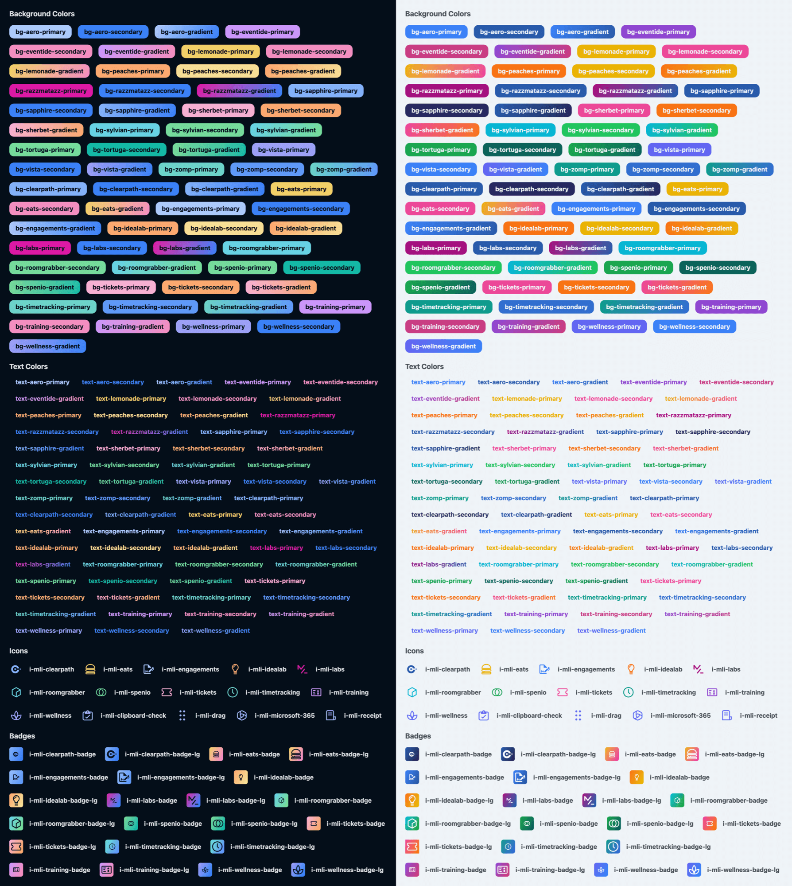

# UnoCSS Preset Moser Labs

Shared UnoCSS preset for the Moser Labs suite of applications.



## Install

```bash
# npm
npm i -D @moser-inc/unocss-preset-moser-labs

# yarn
yarn add -D @moser-inc/unocss-preset-moser-labs

# pnpm
pnpm i -D @moser-inc/unocss-preset-moser-labs
```

## Initialize

```ts
// uno.config.ts

import { defineConfig } from 'unocss';
import { presetMoserLabs } from '@moser-inc/unocss-preset-moser-labs';

export default defineConfig({
  presets: [presetMoserLabs()], // No default
  presets: [presetMoserLabs({ defaultApp: 'wellness', preflight: true })], // With default and preflight

  // Optionally include processing internal Prime components for utility
  // classes and icons
  content: {
    pipeline: {
      include: [
        /(.*\/)primereact(.*)\.(c|m)?(js)(x?)$/, // PrimeReact Components
        /\.(vue|svelte|[jt]sx|mdx?|astro|elm|php|phtml|html)($|\?)/, // Default
      ],
    },
  },
});
```

## Options

```ts
presetMoserLabs({
  /**
   * Set the default theme when the application name is not included in the class (e.g. `bg-primary-gradient`).
   */
  defaultApp?: MoserLabsAppThemeKey;
  /**
   * Whether to include Prime themes as a preflight. Requires `defaultApp` to be set.
   *
   * @default false
   */
  preflight?: boolean;
  /**
   * Extend `presetWind4` options.
   *
   * https://unocss.dev/presets/wind4
   */
  extendWind4Options?: PresetWind4Options;
  /**
   * Extend `presetPrime` options.
   *
   * https://github.com/danielwaltz/unocss-preset-prime
   */
  extendPrimeOptions?: PresetPrimeOptions;
  /**
   * Extend `presetIcons` options.
   *
   * https://unocss.dev/presets/icons
   */
  extendIconsOptions?: PresetIconsOptions;
  /**
   * Extend `presetTypography` options.
   *
   * https://unocss.dev/presets/typography
   */
  extendTypographyOptions?: PresetTypographyOptions;
  /**
   * Extend `presetWebFonts` options.
   *
   * https://unocss.dev/presets/web-fonts
   */
  extendWebFontsOptions?: PresetWebFontsOptions;
});
```

## Semantic Colors

This preset exports helpful types and the generated theme colors directly for extending the theme to support application specific semantic colors.

> :warning: For usage at runtime, use the dedicated export to prevent loading core UnoCSS logic: `import { primeThemeColors } from '@moser-inc/unocss-preset-moser-labs/theme'`.

```ts
// uno.config.ts

import { defineConfig } from 'unocss';
import {
  presetMoserLabs,
  primeThemeColors,
  type Theme,
} from '@moser-inc/unocss-preset-moser-labs';

export default defineConfig({
  presets: [presetMoserLabs()],
  theme: {
    colors: {
      success: {
        dark: primeThemeColors.green[900],
        light: primeThemeColors.green[100],
      },
      warning: {
        dark: primeThemeColors.orange[900],
        light: primeThemeColors.orange[100],
      },
      error: {
        dark: primeThemeColors.red[900],
        light: primeThemeColors.red[100],
      },
    },
  } satisfies Theme,
  shortcuts: {
    'bg-success': 'bg-success-dark light:bg-success-light',
    'bg-warning': 'bg-warning-dark light:bg-warning-light',
    'bg-error': 'bg-error-dark light:bg-error-light',
  },
});
```
